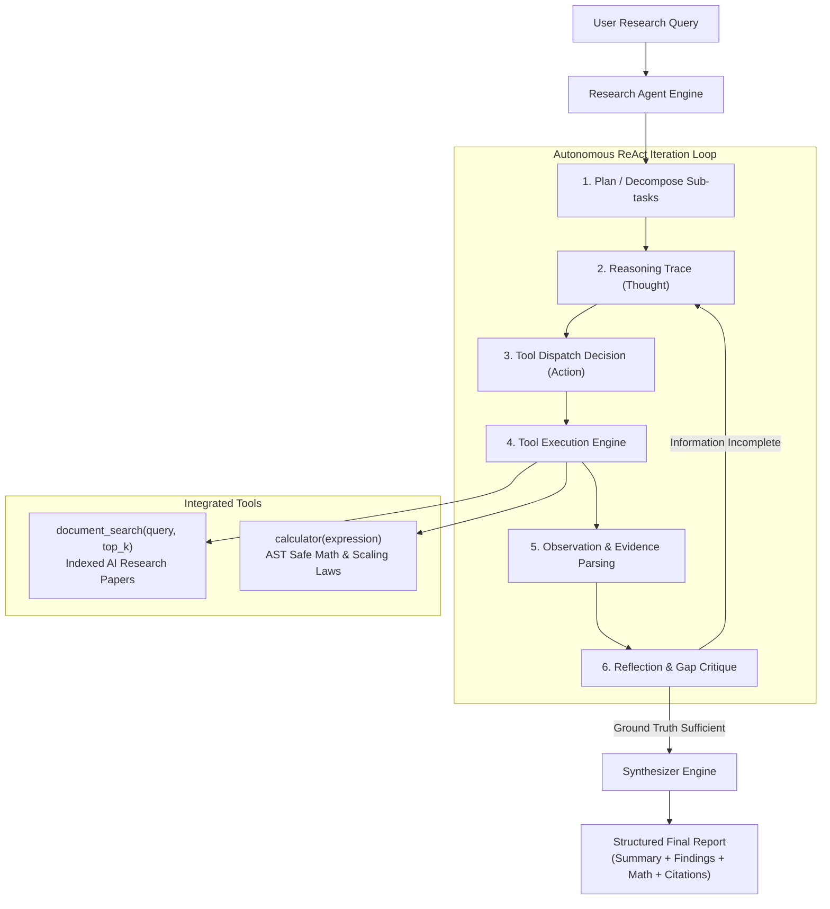

# Autonomous AI Research Agent 🔬

A modular, production-ready implementation of an **Autonomous Technical Research Agent** leveraging the **ReAct (Reasoning + Action + Observation)** paradigm.

The agent decomposes complex engineering inquiries, retrieves facts from a curated and indexed corpus of seminal AI research papers using BM25 lexical ranking, performs verified mathematical scaling evaluations using a secure Abstract Syntax Tree (AST) calculator, and synthesizes structured, fully-cited research reports.

---

## 🏗️ Architecture Overview



---

## 🚀 Key Features

1. **ReAct Reasoning Loop**:
   - Explicit separation between *Thought* (planning/hypothesis), *Action* (tool selection), and *Observation* (evidence integration).
   - Dynamic termination when adequate evidence is collected.

2. **Inverted Index & BM25 Document Search (`tools/document_search.py`)**:
   - Indexed corpus covering Transformer Attention (Vaswani et al.), LoRA (Hu et al.), DPO (Rafailov et al.), DeepSeek-V3 MoE, FlashAttention-2, Chinchilla Scaling Laws, GraphRAG, and Quantization (AWQ/GPTQ/GGUF).
   - Term frequency (TF) and inverse document frequency (IDF) with dynamic snippet generation and citation metadata.

3. **Safe AST Mathematical Calculator (`tools/calculator.py`)**:
   - Evaluates arithmetic and domain-specific scaling calculations (`6 * N * D`, VRAM memory sizing, activated parameter ratios).
   - Zero use of Python's dangerous `eval()`; strictly operates via syntax tree node whitelists.

4. **Dual Provider & Standalone Simulation Engine**:
   - First-class support for **Groq** (`llama-3.3-70b-versatile`) and **OpenAI** (`gpt-4o-mini`).
   - Seamless fallback heuristic simulation mode ensuring complete, high-fidelity offline execution without API keys.

5. **Pydantic Data Schemas (`schemas.py`)**:
   - Strict typing across `ResearchPlan`, `ResearchStep`, `SearchResult`, `CalculationResult`, `ReflectionCritique`, and `AgentFinalReport`.

---

## 📦 Directory Structure

```
research-agent/
├── app.py                  # Interactive CLI and benchmark runner
├── agent.py                # Core ReAct loop, tool dispatcher, and synthesis
├── schemas.py              # Pydantic data contracts
├── config.py               # Provider settings, model configs, system prompts
├── requirements.txt        # Package dependencies
├── README.md               # Project documentation
└── tools/
    ├── __init__.py         # Package exports
    ├── document_search.py  # BM25-indexed research corpus search engine
    └── calculator.py       # Safe AST mathematical evaluation engine
```

---

## 🛠️ Installation & Setup

```bash
cd Month-01/Day-20/AI/research-agent
pip install -r requirements.txt
```

### Environment Variables (Optional):
Create a `.env` file or export your keys:
```bash
# Groq (Recommended for ultra-fast agent tool-calling)
export GROQ_API_KEY="your-groq-api-key"

# OR OpenAI
export OPENAI_API_KEY="your-openai-api-key"
```
*(If no API keys are provided, the agent automatically runs in offline heuristic simulation mode!)*

---

## 💻 Usage

### 1. Run Automated Benchmark Demo:
```bash
python -m AI.research-agent.app --demo
# or from inside research-agent folder:
python app.py --demo
```

### 2. Direct Query Mode with Markdown Export:
```bash
python app.py --query "Analyze DeepSeek-V3 MoE architecture and calculate activated parameter ratio" --export report.md
```

### 3. Interactive Shell:
```bash
python app.py
```
Type any technical question such as:
- *"Compare LoRA parameter reduction against full fine-tuning for a 70B model."*
- *"Calculate VRAM required to host LLaMA-70B in FP16 vs INT4."*
- *"What are Chinchilla compute-optimal scaling laws?"*

---

## 📊 Sample Output

```
======================================================================
  🧠  AUTONOMOUS AI RESEARCH AGENT (ReAct Reasoning Engine)  🔬
======================================================================

[Step 1] Thought: I need to check the exact parameter counts (active vs total) and KV cache optimization in DeepSeek-V3 MoE architecture.
         Tool Invoked: document_search({'query': 'DeepSeek-V3 Mixture of Experts parameters active MLA', 'top_k': 2})
         Observation:
            [1] DeepSeek-V3 Technical Report & Mixture-of-Experts Architecture (Relevance: 1.00)
                Source: https://github.com/deepseek-ai/DeepSeek-V3
                Excerpt: DeepSeek-V3 is a strong Mixture-of-Experts (MoE) language model with 671B total parameters with 37B activated for each token.

[Step 2] Thought: Let's calculate the percentage of activated parameters per token in DeepSeek-V3 (37B active out of 671B total).
         Tool Invoked: calculator({'expression': '(37 / 671) * 100'})
         Observation:
            Calculation Result: 5.514158 (Raw: 5.514157973174367)

======================================================================
                    📑 FINAL RESEARCH REPORT                    
======================================================================
🎯 Research Query: Analyze DeepSeek-V3 MoE architecture, token activation ratio, and training FLOP compute budget.
📊 Confidence Score: 96.0% | Total Steps: 4

📌 Executive Summary:
   Comprehensive technical synthesis for 'Analyze DeepSeek-V3 MoE architecture...'. Analysis incorporated 4 iterative reasoning and tool execution steps, querying verified architectural papers and performing safe numerical evaluations.

🔍 Key Verified Findings:
   1. DeepSeek-V3 is a strong Mixture-of-Experts (MoE) language model with 671B total parameters with 37B activated for each token.
   2. It adopts Multi-head Latent Attention (MLA) for efficient inference by compressing KV cache into low-dimensional latent vectors.
   3. DeepSeekMoE architecture utilizes fine-grained expert segmentation (256 routed experts + 1 shared expert) with top-8 routing.

📐 Quantitative Calculations & Scaling:
   * Expression: `(37 / 671) * 100` => Calculation Result: 5.514158 (Raw: 5.514157973174367)
   * Expression: `6 * 671000000000 * 14800000000000` => Calculation Result: 59,584,800,000,000,000,000,000.0000 (59,584.80 Billion / 5.96e+25)

📚 Verified Citations:
   [1] DeepSeek-V3 Technical Report & Mixture-of-Experts Architecture (DeepSeek-AI, 2024)
       Citation/URL: https://github.com/deepseek-ai/DeepSeek-V3
```
