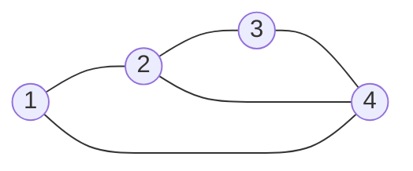
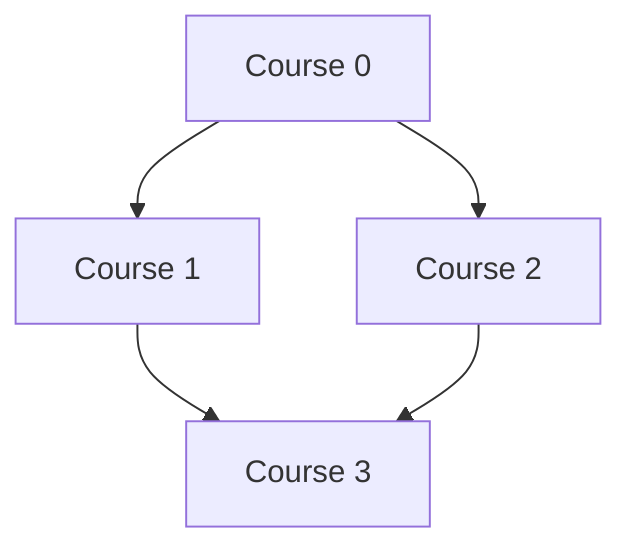

# Month 01 - Day 20 Study Notes: Graph Algorithms & Autonomous AI Research Agents

---

## 📌 Executive Summary

Day 20 of the GenAI Engineer Roadmap covers two foundational engineering pillars:
1. **Graph Algorithms in Data Structures & Systems Engineering**:
   - Graph representations (Adjacency Matrix, Adjacency List).
   - Breadth-First Search (BFS) and Depth-First Search (DFS) on 2D Grids and Directed/Undirected Graphs.
   - Connected component discovery (*Number of Islands*).
   - Deep memory graph serialization & cloning (*Clone Graph*).
   - Topological Sorting and Directed Acyclic Graph (DAG) cycle detection using Kahn's Algorithm & DFS 3-State Coloring (*Course Schedule*).
2. **Autonomous AI Research Agents (ReAct Architecture)**:
   - The ReAct (Reasoning + Action + Observation) paradigm.
   - Decomposing multi-hop research queries into structured sub-tasks.
   - Implementing dynamic tool invocation over inverted-index lexical search (BM25) and secure AST mathematical evaluation.
   - Error handling, reflection, self-correction, and citation grounding.

---

## 🧠 Part 1: Graph Theory & Algorithms Deep-Dive

### 1. Graph Representations

| Representation | Memory Complexity | Edge Lookup $(u \to v)$ | Degree / Neighbors of $u$ | Best Use Case |
| :--- | :--- | :--- | :--- | :--- |
| **Adjacency Matrix** | $O(V^2)$ | $O(1)$ | $O(V)$ | Dense graphs where $E \approx V^2$ or fast edge queries are required. |
| **Adjacency List** | $O(V + E)$ | $O(\text{deg}(u))$ | $O(\text{deg}(u))$ | Sparse graphs where $E \ll V^2$ (almost all real-world web/knowledge graphs). |
| **Edge List** | $O(E)$ | $O(E)$ | $O(E)$ | Kruskal's MST algorithm, stream processing. |

---

### 2. Number of Islands (2D Grid Connected Components)

Given an $M \times N$ matrix of `'1'`s (land) and `'0'`s (water):

```
1 1 0 0 0
1 1 0 0 0
0 0 1 0 0
0 0 0 1 1   => Total Islands = 3
```

#### Algorithmic Approaches:
1. **DFS (Sink Approach)**:
   - When `'1'` is found at $(r, c)$, increment `count` and trigger DFS.
   - Mark $(r, c)$ as `'0'` (visited) and recursively explore orthogonal neighbors: $(r+1,c), (r-1,c), (r,c+1), (r,c-1)$.
   - **Time Complexity:** $O(M \times N)$ since every cell is visited at most 4 times.
   - **Space Complexity:** $O(M \times N)$ in the worst case (full land matrix).

2. **BFS (Queue Approach)**:
   - Enqueue $(r, c)$ and immediately mark `'0'`.
   - While queue is not empty, dequeue $(r, c)$ and enqueue unvisited land neighbors, marking them `'0'` immediately upon enqueueing to prevent duplicate insertions.
   - **Space Complexity:** $O(\min(M, N))$ max queue length along matrix diagonal.

3. **Disjoint Set Union (DSU / Union-Find)**:
   - Map 2D coordinate $(r, c)$ to 1D ID: $\text{ID} = r \times \text{cols} + c$.
   - Union adjacent land cells. Track number of disjoint sets.
   - **Time Complexity:** $O(M \times N \cdot \alpha(M \times N))$.

---

### 3. Clone Graph (Deep Copy of Graph with Cycles)

Cloning a graph requires creating new `Node` instances for every vertex while preserving exact neighbor relationships and avoiding infinite loops caused by cycles.



#### Key Technique: Visited Hash Map (`Map<Node, Node>`)
- Map keys store pointers to **original nodes**, and values store pointers to **cloned nodes**.
- **DFS Recursive**:
  - If `visited.containsKey(node)`, return `visited.get(node)`.
  - Otherwise, create `clone = new Node(node.val)`, register `visited.put(node, clone)`, and recursively clone all neighbors.
- **Time Complexity:** $O(V + E)$
- **Space Complexity:** $O(V)$ hash map + recursion stack.

---

### 4. Course Schedule & Topological Sorting (Cycle Detection)

A valid course prerequisite ordering exists **if and only if** the dependency graph is a **Directed Acyclic Graph (DAG)**.



#### Approach 1: Kahn's Algorithm (BFS In-Degree Queue)
1. Build adjacency list $u \to v$ where $u$ is prerequisite and $v$ is dependent course.
2. Compute `inDegree[v]` for all $v \in V$.
3. Enqueue all vertices where `inDegree[u] == 0`.
4. While queue has items:
   - Dequeue $u$, increment `processedCount`.
   - For each neighbor $v$ of $u$, decrement `inDegree[v]`.
   - If `inDegree[v] == 0`, enqueue $v$.
5. If `processedCount == numCourses`, graph is a DAG (True); otherwise cycle exists (False).

#### Approach 2: 3-State DFS Coloring
- `0 (UNVISITED)`: Node has not been touched.
- `1 (VISITING)`: Node is currently in the active recursion call stack. **If an edge leads to a `VISITING` node, a back-edge (cycle) exists!**
- `2 (VISITED)`: Node and all its descendants have been fully processed.

```
Time Complexity: O(V + E)
Space Complexity: O(V + E)
```

---

## 🤖 Part 2: Autonomous AI Research Agents (ReAct Loop)

### 1. Anatomy of the ReAct Paradigm

The ReAct framework (Yao et al., 2022) addresses the two primary flaws of LLMs:
1. **Hallucination in Pure Reasoning (CoT)**: Models invent non-existent facts without grounding.
2. **Blindness in Pure Action (Tool Use)**: Models execute tools without a strategic planning trace.

```
┌────────────────────────────────────────────────────────┐
│                      ReAct Loop                        │
│                                                        │
│  User Query ──► Thought 1 ──► Action 1 (Tool Call)     │
│                                      │                 │
│                                      ▼                 │
│                 Thought 2 ◄── Observation 1 (Output)   │
│                     │                                  │
│                     ▼                                  │
│                 Action 2  ──► Observation 2            │
│                                      │                 │
│                                      ▼                 │
│                 Final Thought ──► Synthesized Report   │
└────────────────────────────────────────────────────────┘
```

---

### 2. Core Agent Modules

1. **Planner / Decomposer**: Breaks complex questions into sequential sub-tasks.
2. **Lexical & Semantic Search Engine**: BM25 / TF-IDF inverted index ranking across technical literature.
3. **Deterministic Math Sandbox**: Safe Abstract Syntax Tree (AST) evaluation preventing prompt injections while providing 100% arithmetic precision.
4. **Reflection Critic**: Validates whether gathered evidence resolves all sub-queries before synthesizing output.

---

## 💡 Key Takeaways & Best Practices

1. **Graph Traversal Safety**: Always mark nodes visited upon enqueueing in BFS to prevent exponential duplicate queue insertions.
2. **AST Evaluation Over `eval()`**: Never evaluate LLM-generated math with Python `eval()` in production. Always parse expressions using `ast.parse` and whitelist approved binary and unary operators.
3. **Grounding & Citations**: Autonomous research agents must preserve snippet provenance and citation links across all reasoning steps to guarantee factual verifiable answers.
