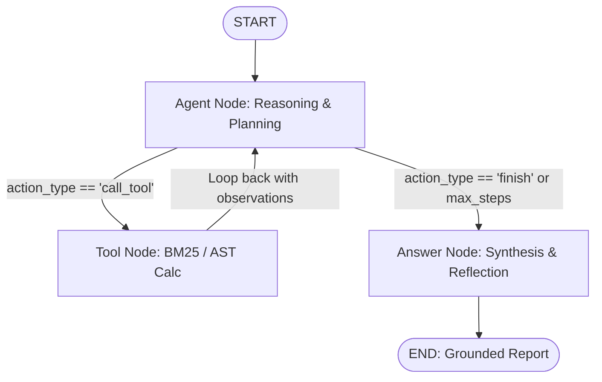

# StateGraph Autonomous AI Research Agent 🤖📊

A production-grade, stateful autonomous research agent built using the **LangGraph State Graph architecture**. 
It executes cyclic reasoning-action-reflection loops over inverted-index lexical search (BM25) and secure Abstract Syntax Tree (AST) mathematical evaluation.

---

## 🏛️ Architecture Overview

The system models research as a stateful cyclic graph where state transitions are governed by functional node reducers and conditional edge routers.



### Core Components:
1. **`state.py` (`ResearchState`)**:
   - Centralized typed state schema tracking queries, message memory, step count, tool execution history, verified citations, AST calculation caches, and execution trajectory.
2. **`nodes/agent_node.py`**:
   - The central reasoning engine. Analyzes the current research context, plans next actions, and outputs structured `AgentThought` decisions (supporting Groq LPU, OpenAI, and deterministic simulation).
3. **`nodes/tool_node.py`**:
   - Isolated tool execution engine. Dispatches calls to `document_search` or `calculator`, catches runtime exceptions, merges unique citations, and updates observations.
4. **`nodes/answer_node.py`**:
   - Reflection and synthesis node. Grounds facts against retrieved papers, formats quantitative tables, and outputs the final `ResearchReport`.
5. **`graph.py`**:
   - State graph topology definition. Compiles entry points, cyclic loops, conditional edges, and step-by-step stream visualizers.

---

## 🛠️ Tools

| Tool | Implementation | Purpose |
| :--- | :--- | :--- |
| **`document_search`** | Inverted Index BM25 Lexical Ranking | Retrieves authoritative architectural specs and empirical results from indexed AI research papers. |
| **`calculator`** | Safe Python AST Parsing | Evaluates mathematical formulas (FLOPs, scaling laws, activated parameter ratios) without unsafe `eval()`. |

---

## 🚀 Quick Start

### 1. Installation
```bash
cd Month-01/Day-21/AI/research-agent
pip install -r requirements.txt
```

### 2. Environment Setup (Optional)
If API keys are provided in `.env`, the agent uses live LLM reasoning:
```bash
GROQ_API_KEY=gsk_...
# or
OPENAI_API_KEY=sk-...
```
*Note: If no API keys are configured, the agent runs in high-fidelity deterministic simulation mode automatically.*

### 3. Usage Examples

**Run Automated Benchmark Suite:**
```bash
python app.py --demo
```

**Run Single Research Query with Markdown Export:**
```bash
python app.py --query "Analyze DeepSeek-V3 MoE architecture and calculate activated parameter percentage ratio" --export deepseek_report.md
```

**Interactive Shell:**
```bash
python app.py
```
