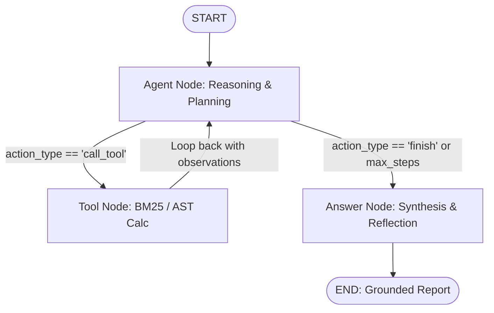

# Month 1 - Day 21

## 📚 Topics Learned
- **StateGraph / LangGraph Agent Architecture**: Cyclic state machines, functional state reducers, typed state schemas, and conditional routing edges.
- **Dynamic Reasoning & Tool Orchestration**: Interleaving reasoning thoughts with BM25 literature search and AST mathematical evaluation.
- **Secure AST Computation**: Eliminating Python `eval()` remote code execution risks via AST parse-tree whitelisting.
- **Inverted Index BM25 Lexical Retrieval**: TF-IDF saturation and document length normalization for AI research corpus search.
- **Graph Algorithms in Java**:
  - 2D Grid Connected Components & Island Sinking (LeetCode 200 - *Number of Islands*).
  - Topological Sorting & DAG Cycle Detection (LeetCode 207 - *Course Schedule*).
  - Memory Graph Serialization & Deep Copy Isolation (LeetCode 133 - *Clone Graph*).

---

## 🤖 AI Project: StateGraph Autonomous Research Agent (`AI/research-agent/`)

A multi-node cyclic state graph agent that investigates complex AI research topics, queries seminal literature using BM25 lexical ranking, evaluates mathematical formulas (FLOPs, scaling laws, activated parameter ratios) via an AST calculator, and synthesizes structured, citation-grounded reports.



---

## 🧩 DSA (Java): Graph Algorithms
1. **Number of Islands** (`DSA/number_of_islands.java`): LeetCode 200 - DFS Sink $O(M \times N)$, BFS Queue $O(M \times N)$ with $O(\min(M, N))$ space, and Disjoint Set Union (Union-Find).
2. **Course Schedule** (`DSA/course_schedule.java`): LeetCode 207 - Cycle detection in directed graphs using Kahn's Algorithm (BFS In-Degree Queue) and 3-State DFS Coloring.
3. **Clone Graph** (`DSA/clone_graph.java`): LeetCode 133 - Deep copy of cyclic undirected graph using DFS and BFS with `HashMap<Node, Node>` reference isolation.

---

## 📝 Interview Preparation
- **Technical Questions (`Interview/technical_questions.md`)**: StateGraphs vs Linear DAGs, state persistence and checkpointing, preventing runaway agent loops, AST security vs `eval()`, and multi-agent state reducers.
- **Coding Questions (`Interview/coding_questions.md`)**: BFS vs DFS memory trade-offs, Kahn's algorithm vs DFS coloring, deep copying cyclic graphs, and Inverse Ackermann complexity $\alpha(N)$.
- **Recruiter Questions (`Interview/recruiter_questions.md`)**: STAR-format responses for transitioning from chains to state graphs, production cyclic debugging, and balancing latency/cost SLAs.

---

## 📁 Folder Structure

```
Day-21/
│
├── Notes/
│   └── day21_notes.md
│
├── AI/
│   └── research-agent/
│       ├── app.py
│       ├── graph.py
│       ├── state.py
│       ├── nodes/
│       │   ├── agent_node.py
│       │   ├── tool_node.py
│       │   └── answer_node.py
│       ├── tools/
│       │   ├── document_search.py
│       │   └── calculator.py
│       ├── schemas.py
│       ├── config.py
│       ├── requirements.txt
│       └── README.md
│
├── DSA/
│   ├── number_of_islands.java
│   ├── course_schedule.java
│   └── clone_graph.java
│
├── Interview/
│   ├── technical_questions.md
│   ├── coding_questions.md
│   └── recruiter_questions.md
│
├── Resources.md
└── README.md
```

---

## 🚀 How to Run

### 1. AI StateGraph Research Agent:
```bash
cd Month-01/Day-21/AI/research-agent
pip install -r requirements.txt

# Run automated benchmark suite:
python app.py --demo

# Run single query with markdown export:
python app.py --query "Analyze DeepSeek-V3 MoE architecture and calculate activated parameter percentage ratio" --export report.md

# Run interactive shell:
python app.py
```

### 2. DSA (Java Solutions & Test Suites):
```bash
cd Month-01/Day-21/DSA

# Number of Islands
javac number_of_islands.java
java number_of_islands

# Course Schedule
javac course_schedule.java
java course_schedule

# Clone Graph
javac clone_graph.java
java clone_graph
```
