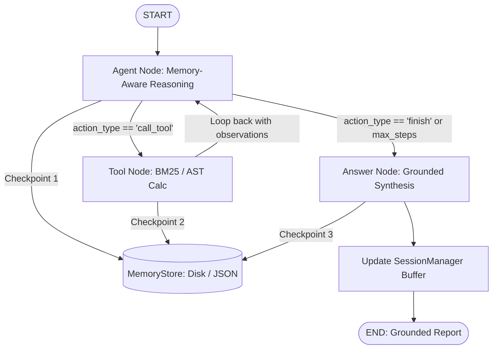

# Persistent StateGraph Research Agent with Memory 🧠💾

A production-grade, stateful autonomous research agent built with the **LangGraph State Graph architecture** and persistent memory checkpointing.
It executes cyclic reasoning-action-reflection loops with cross-turn episodic memory buffers and file-backed state serialization.

---

## 🏛️ Architecture & Checkpointing Pipeline



### Core Components:
1. **`memory/memory_store.py` (`MemoryStore`)**:
   - Manages step-level immutable state snapshots indexed by `thread_id` and `checkpoint_id`.
   - Supports time-travel state rollback and multi-thread session management.
2. **`memory/session_manager.py` (`SessionManager`)**:
   - Extracts key facts and summaries from completed turns.
   - Formats sliding-window episodic context for multi-turn conversations.
3. **`state.py` (`ResearchState`)**:
   - Unified typed state dictionary maintaining `thread_id`, `session_id`, `checkpoint_id`, `session_memory`, `observations`, and `citations`.
4. **`nodes/`**:
   - `agent_node.py`: Reasoning node reading past memories.
   - `tool_node.py`: Tool execution with BM25 retrieval and safe AST arithmetic.
   - `answer_node.py`: Fact-grounded synthesis with structured metrics.
5. **`graph.py` (`PersistentStateGraph`)**:
   - Compiles cyclic state graph with automatic step-by-step checkpointing.

---

## 🚀 Quick Start

### 1. Installation
```bash
cd Month-01/Day-22/AI/research-agent
pip install -r requirements.txt
```

### 2. Multi-Turn Demo Benchmark
```bash
python app.py --demo
```

### 3. Single Query Execution with Markdown Export
```bash
python app.py --query "Analyze DeepSeek-V3 MoE architecture and calculate activated parameter percentage ratio" --export report.md
```

### 4. Interactive Multi-Turn Shell
```bash
python app.py
```
