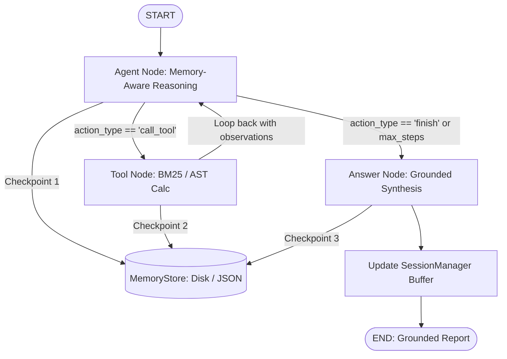

# Month 1 - Day 22

## 📚 Topics Learned
- **Persistent StateGraph Architecture & Memory**: Step-level checkpointing, state serialization, and multi-turn conversational session management.
- **Time-Travel Debugging**: Snapshotting immutable state records (`thread_id`, `checkpoint_id`) for rollbacks and branch exploration.
- **Context Compaction**: Sliding-window buffer memory and structured fact extraction for long-running research sessions.
- **Multi-Source Graph BFS**: Simultaneous multi-origin wave expansion and level-by-level timing (*Rotting Oranges*).
- **Connected Component Analysis**: Adjacency matrix component discovery using DFS, BFS, and DSU (*Number of Provinces*).

---

## 🤖 AI Project: Persistent StateGraph Research Agent with Memory (`AI/research-agent/`)

A stateful research agent equipped with file-backed state checkpointing and multi-turn episodic memory buffers. It investigates complex AI topics, retains verified facts across conversation turns, evaluates mathematical expressions via safe AST, and outputs grounded reports.



---

## 🧩 DSA (Java): Graph Algorithms
1. **Number of Provinces** (`DSA/number_of_provinces.java`): LeetCode 547 - DFS $O(N^2)$, BFS $O(N^2)$, and Disjoint Set Union $O(N^2 \cdot \alpha(N))$.
2. **Rotting Oranges** (`DSA/rotting_oranges.java`): LeetCode 994 - Multi-Source BFS level-by-level infection wave propagation in $O(M \times N)$ time.
3. **Course Schedule** (`DSA/course_schedule.java`): LeetCode 207 - Kahn's BFS In-Degree Topological Sort and 3-State DFS Cycle Detection.

---

## 📝 Interview Preparation
- **Technical Questions (`Interview/technical_questions.md`)**: Production checkpointing design, context window saturation management, Single-Source vs Multi-Source BFS, and time-travel state replay.
- **Coding Questions (`Interview/coding_questions.md`)**: Multi-Source BFS optimality in Rotting Oranges, Number of Provinces DSU vs DFS trade-offs, and streaming graph updates.
- **Recruiter Questions (`Interview/recruiter_questions.md`)**: STAR-format responses for fault-tolerant agent state persistence and multi-turn context compaction.

---

## 📁 Folder Structure

```
Day-22/
│
├── Notes/
│   └── day22_notes.md
│
├── AI/
│   └── research-agent/
│       ├── app.py
│       ├── graph.py
│       ├── state.py
│       ├── memory/
│       │   ├── memory_store.py
│       │   └── session_manager.py
│       ├── nodes/
│       │   ├── agent_node.py
│       │   ├── tool_node.py
│       │   └── answer_node.py
│       ├── tools/
│       │   ├── document_search.py
│       │   └── calculator.py
│       ├── schemas.py
│       ├── config.py
│       ├── requirements.txt
│       └── README.md
│
├── DSA/
│   ├── number_of_provinces.java
│   ├── rotting_oranges.java
│   └── course_schedule.java
│
├── Interview/
│   ├── technical_questions.md
│   ├── coding_questions.md
│   └── recruiter_questions.md
│
├── Resources.md
└── README.md
```

---

## 🚀 How to Run

### 1. AI StateGraph Research Agent with Memory:
```bash
cd Month-01/Day-22/AI/research-agent
pip install -r requirements.txt

# Run automated multi-turn memory benchmark:
python app.py --demo

# Run single query with markdown export:
python app.py --query "Analyze DeepSeek-V3 MoE architecture and calculate activated parameter percentage ratio" --export report.md

# Run interactive multi-turn shell:
python app.py
```

### 2. DSA (Java Solutions & Test Suites):
```bash
cd Month-01/Day-22/DSA

# Number of Provinces
javac number_of_provinces.java
java number_of_provinces

# Rotting Oranges
javac rotting_oranges.java
java rotting_oranges

# Course Schedule
javac course_schedule.java
java course_schedule
```
