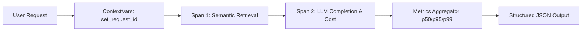

# 📅 Day 24 Study Notes: LLM Observability & Monotonic Data Structures

## 🧠 Core Engineering Principles

### 1. The GenAI Observability Pipeline
Modern LLM pipelines require fine-grained instrumentation across four fundamental stages:
1. **Input Span**: User query capture, PII redaction, token estimation, and guardrail validation latency.
2. **Retrieval Span**: Query expansion, dense & sparse vector search duration, hit count, and similarity distribution.
3. **Generation Span**: Prompt formatting, LLM Time-To-First-Token (TTFT), completion tokens, cost in USD, and finish reasons.
4. **Output Span**: Hallucination scoring, regex schema verification, and downstream response dispatch.

### 2. Token Cost Tracking
LLM billing is strictly asynchronous and based on tokens, not characters.
Formula:
$$\text{Cost} = \left(\frac{\text{Prompt Tokens}}{1,000,000} \times \text{Input Price}\right) + \left(\frac{\text{Completion Tokens}}{1,000,000} \times \text{Output Price}\right)$$

### 3. Monotonic Stack & Queue (Java)
- Monotonic stacks maintain elements in strictly monotonic (increasing or decreasing) order.
- In sliding window problems (LeetCode 239), monotonic deques allow retrieving the window's maximum/minimum in $O(1)$ amortized time.
