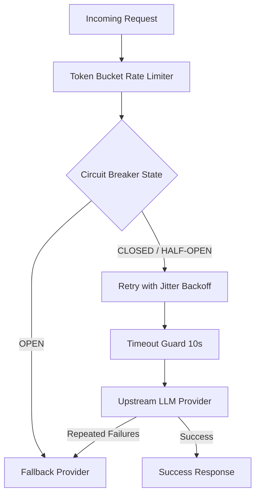

# 📅 Day 25 Study Notes: Production Reliability & Advanced Binary Search

## 🧠 Core Engineering Principles

### 1. The Production Reliability Stack for GenAI
LLM APIs are fundamentally prone to timeouts, 429 rate limits, and 503 capacity errors. A resilient pipeline layers multiple defenses:

### 2. Rate Limiting: Token Bucket Algorithm
- Capacity $C$: Maximum burst tokens.
- Refill Rate $R$: Tokens replenished per second.
- Mathematical advantage: Seamlessly accommodates instantaneous traffic bursts while enforcing strict long-term throughput limits.

### 3. Binary Search Invariants (Java)
- Rotated Sorted Array: At least one half of the array $[left, mid]$ or $[mid, right]$ is always strictly sorted. Compare target against the boundaries of the sorted half.
- Capacity on Answer Space: When the problem statement asks for an optimal value and the condition is monotonic, define search range $[low, high]$ and test with a predicate function.
