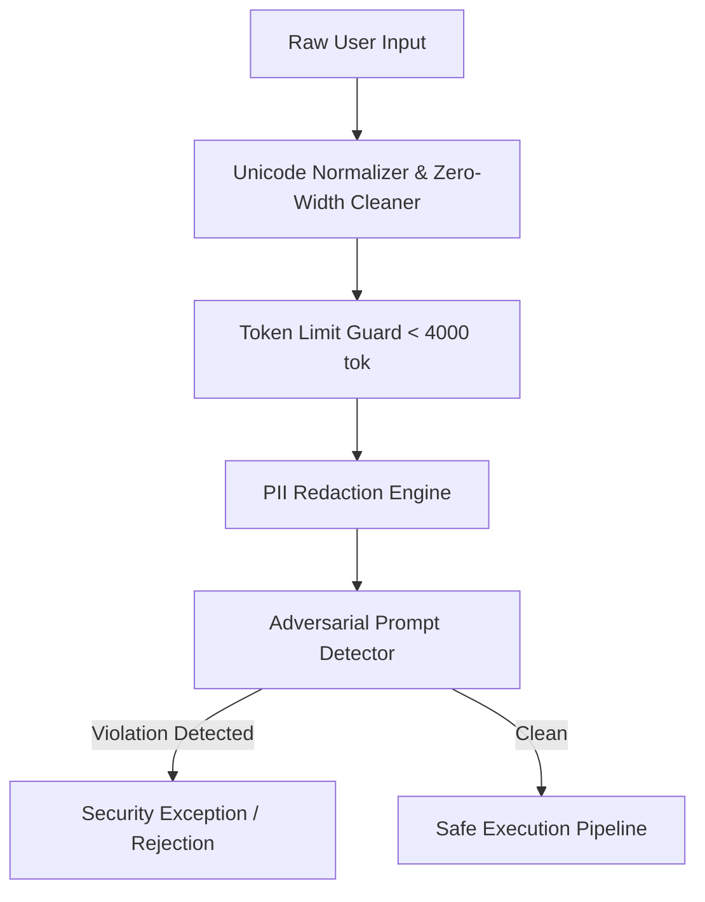

# 📅 Day 26 Study Notes: GenAI Security & Linked List Pointer Cycles

## 🧠 Core Engineering Principles

### 1. OWASP Top 10 for Large Language Models
The most critical vulnerabilities in production AI architectures include:
- **LLM01: Prompt Injection** — Crafty user input altering LLM execution behavior.
- **LLM02: Sensitive Information Disclosure** — Leaking system prompts, proprietary data, or tenant PII.
- **LLM04: Model Denial of Service** — Submitting abnormally high context payloads to exhaust GPU compute.
- **LLM07: Insecure Plugin / Tool Design** — Granting agents unbounded system access (e.g., raw bash execution) without parameter validation and strict allowlists.

### 2. Defense-in-Depth Pipeline
Never rely on prompt engineering alone (e.g. telling the LLM "Please don't leak this"). A deterministic deterministic gateway layer must intercept requests before they reach the model tokenizer.

### 3. Cycle Finding & Two-Pointer Invariants (Java)
- Floyd's cycle detection guarantees convergence inside any loop within $O(N)$ operations with zero heap allocation.
- In-place reversal of the latter half of a singly-linked list allows $O(N)$ palindrome verification in $O(1)$ space.
