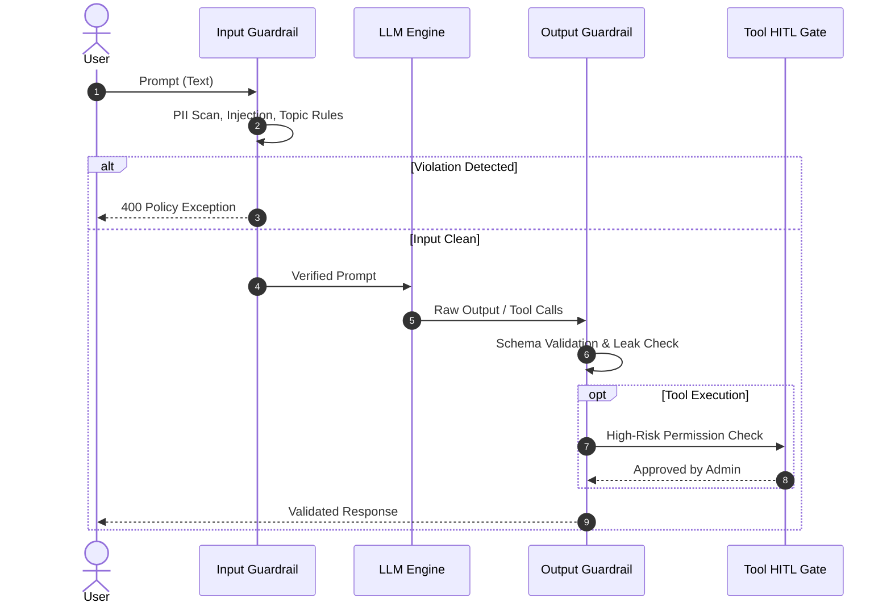

# 📅 Day 27 Study Notes: Guardrails Architecture & Advanced Tree Traversals

## 🧠 Core Engineering Principles

### 1. Guardrail Execution Lifecycle

### 2. Schema Validation Strategies
1. **Syntactic Validation**: Verifying that the LLM payload is well-formed JSON string.
2. **Structural Validation**: Ensuring all required schema keys are present.
3. **Semantic / Type Validation**: Checking that fields conform to integer, float, string, or boolean constraints without hallucinated extra keys.

### 3. Tree Recursion Invariants (Java)
- Diameter & Path Sum problems require tracking two quantities simultaneously:
  1. The global maximum answer discovered so far that spans *through* the current node as an inverted "V".
  2. The single linear branch sum returned up to the parent caller ($val + \max(left, right)$).
