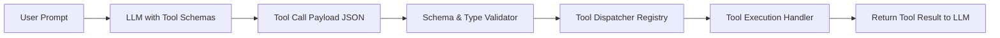

# 📅 Day 28 Study Notes: Structured Output, Tool Dispatching & Trie Structures

## 🧠 Core Engineering Principles

### 1. Function Calling & Dispatch Architecture
Modern agentic systems rely on function calling to interface with APIs, databases, and business services.



### 2. Output Cleaning & JSON Resilience
Production LLM responses frequently wrap JSON inside markdown fences (```` ```json ... ``` ````) or append extraneous trailing commas. An output parser should perform defensive stripping and sanitization before calling `json.loads`.

### 3. Trie Invariants & Wildcard Search (Java)
- Each Trie node represents a character transition.
- For wildcard character queries (such as `.` in LeetCode 211), branch into all non-null children array indices $[0..25]$ with DFS backtracking.
