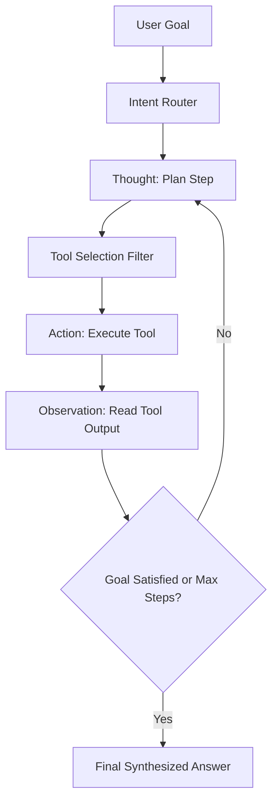

# 📅 Day 29 Study Notes: Autonomous Agents & Priority Queues

## 🧠 Core Engineering Principles

### 1. The ReAct (Reason + Act) Loop
The ReAct paradigm interleaves reasoning traces and task-specific actions:

### 2. State Management Architecture
- Keep agent state immutable or append-only.
- Track distinct lists for thought traces (`scratchpad`) versus machine-readable records (`tool_history`).

### 3. Dual Heap Balancing Invariant (Java)
- To maintain balanced halves, push new numbers into `lowerMaxHeap` first, immediately transfer its root to `upperMinHeap`, and balance lengths so `lowerMaxHeap.size() >= upperMinHeap.size()`.
