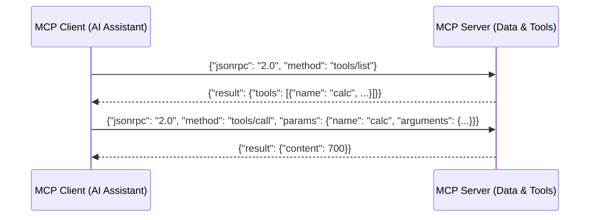

# 📅 Day 30 Study Notes: Model Context Protocol (MCP) & Graph Shortest Paths

## 🧠 Core Engineering Principles

### 1. Model Context Protocol Architecture
MCP uses JSON-RPC 2.0 messages over standard I/O (`stdio`) or Server-Sent Events (`SSE`):

### 2. Core Protocol Primitives
- **Tools**: Executable functions that take structured JSON input and execute code/actions.
- **Resources**: Read-only context documents identified by custom URI schemes.
- **Prompts**: Standardized reusable prompt templates with variable parameters.

### 3. Dijkstra vs Bellman-Ford Invariants (Java)
- Dijkstra tracks finalized shortest distances in a `minDistance` map, skipping nodes already visited.
- Bellman-Ford snapshotting (`tempPrices = Arrays.copyOf(prices, n)`) prevents cascading multi-edge updates within a single iteration when bounding path lengths to $K$ stops.
