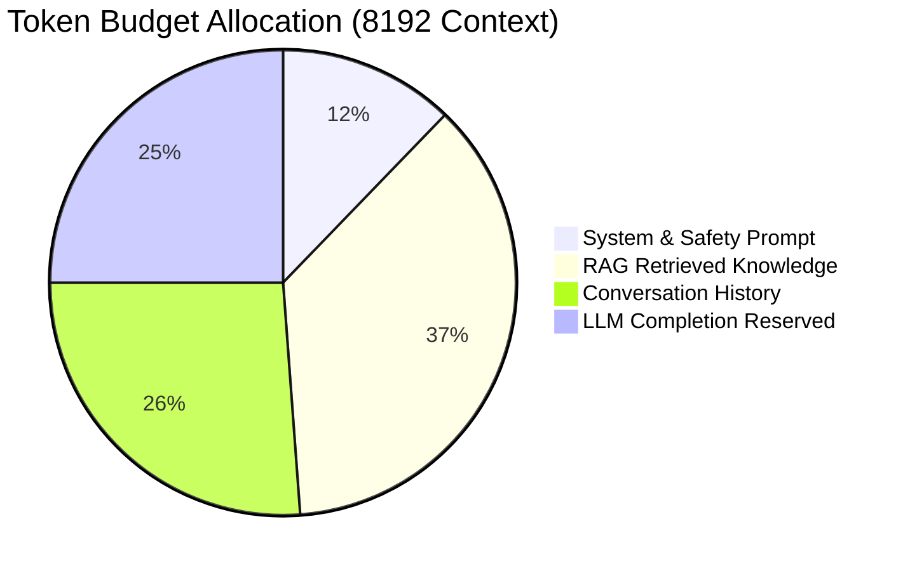

# 📅 Day 01 (Month 03) Study Notes: Context Engineering, Memory Architecture & DSU

## 🧠 Core Engineering Principles

### 1. The Production Context Engineering Stack
A production context manager budgets tokens into explicit partitions:

### 2. Multi-Tier Memory Topology
1. **Short-Term Buffer**: Exact last $N$ dialogue turns.
2. **Medium-Term Summary**: Rolling progressive summary of past conversation turns.
3. **Long-Term Episodic Store**: External knowledge base storing enduring user preferences, identity traits, and historical decisions.

### 3. DSU & Kruskal's MST Invariants (Java)
- Kruskal's algorithm greedily processes edges sorted by ascending weight.
- If $u$ and $v$ belong to different connected components (`dsu.union(u, v) == true`), include the edge in the tree.
- Terminate once exactly $N-1$ edges are added to form the optimal spanning tree.
