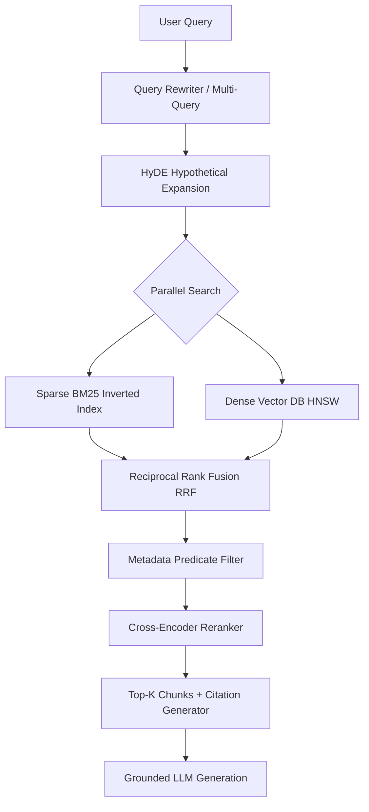

# 📅 Day 02 (Month 03) Study Notes: Advanced RAG Architecture & Backtracking

## 🧠 Core Engineering Principles

### 1. Multi-Stage Advanced RAG Funnel
A modern enterprise RAG system uses a funnel architecture:

### 2. Parent-Child Hierarchical Chunking
Embedding tiny chunks (100 tokens) provides high semantic granularity without sentence dilution. Returning the larger parent document (1000 tokens) to the LLM provides sufficient context to avoid incomplete thought generation.

### 3. Backtracking State Invariants (Java)
- Every recursive decision tree requires three phases:
  1. **Choose**: Update state variables and mark visited positions.
  2. **Explore**: Recurse down the search branch.
  3. **Un-choose (Backtrack)**: Revert state modifications to maintain clean invariants for parallel sister branches.
