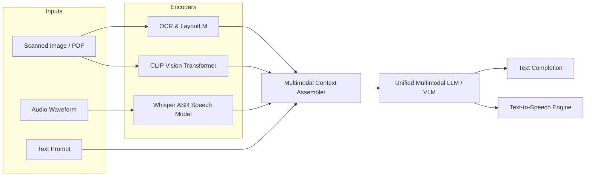

# 📅 Day 03 (Month 03) Study Notes: Multimodal GenAI Systems & Dynamic Programming on Trees

## 🧠 Core Engineering Principles

### 1. Multimodal AI Modality Integration Architecture

### 2. Modality Alignment in Shared Vector Spaces
- Models like CLIP map text and images to unit hyperspheres using contrastive InfoNCE loss.
- Cosine similarity $\cos(\theta) = \frac{\mathbf{u} \cdot \mathbf{v}}{\|\mathbf{u}\| \|\mathbf{v}\|}$ enables text-to-image semantic indexing.

### 3. Tree DP Post-Order Invariants (Java)
- Bottom-up evaluation computes optimal subtree states before synthesizing parent choices.
- In knapsack variations (0-1 Knapsack), reverse loop traversal ($j$ from $target$ down to $num$) guarantees each item is included at most once.
