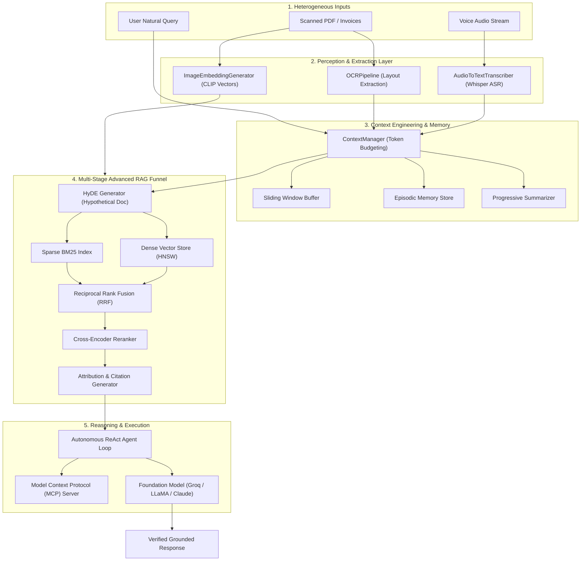
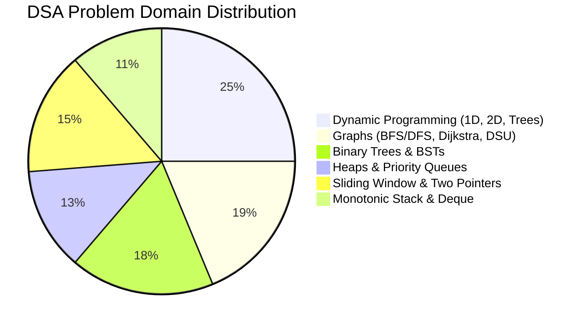

# 🤖 GenAI Engineer Roadmap — 9-Month Production Journey

<div align="center">

[](https://www.python.org/)
[](https://www.oracle.com/java/)
[](https://fastapi.tiangolo.com/)
[](https://www.docker.com/)
[](https://www.langchain.com/)
[](https://groq.com/)
[](#-current-learning-focus--month-03)
[](https://opensource.org/licenses/MIT)

<p align="center">
  <b>Architecting scalable, production-grade Generative AI systems from first principles.</b><br>
  Covering Fine-Tuning, Production Reliability, LLM Observability, AI Security, Model Context Protocol (MCP), Autonomous ReAct Agents, Multi-Stage Advanced RAG, Multimodal Pipelines, and Daily Data Structures & Algorithms in Java.
</p>

</div>

---

## 📈 Executive Dashboard & Metrics

<div align="center">

| 🗓️ Total Days Completed | 🧠 Production AI Services | ☕ Java DSA Patterns Solved | 🛡️ Security & Guardrail Suites | 🏆 Month Status |
|:---:|:---:|:---:|:---:|:---:|
| **69 Days** | **40+ Microservices** | **95+ Algorithms** | **15 Defense Layers** | **Month 03 Active** |

</div>

```mermaid
%%{init: {'theme': 'dark', 'themeVariables': { 'fontSize': '14px', 'fontFamily': 'Inter, sans-serif'}}}%%
timeline
    title 9-Month GenAI Engineering Evolution
    section Month 01 : Completed ✅
        Foundations & OOP : Python, Groq, ChromaDB, RAG, FastAPI, SQL
        Advanced RAG & SSE : PDF Chunking, Streaming, Monotonic Stacks, Sliding Windows
        Agent Tool Calling : Function Schemas, Reflection Dispatcher, AST Calculator
    section Month 02 : Completed ✅
        Fine-Tuning & Docker : LoRA, PEFT, JWT Auth, Docker Compose, Caching
        Security & Reliability : Injection Firewall, Rate Limiting, Circuit Breaker, Guardrails
        Agents & MCP : Structured Output, ReAct Loops, Model Context Protocol
    section Month 03 : Active 🚀
        Context & Retrieval : Token Budgets, Multi-Tier Memory, Hybrid BM25 & Dense RRF
        Rerankers & Guardrails : Cross-Encoders, Context Compression, Dual-Rail Safety
        Streaming & Security : Real-Time SSE Backpressure, Canary Token Traps, Tree & Graph DSA
    section Months 04-09 : Upcoming ⏳
        Distributed Systems & Pretraining : DeepSpeed, Megatron-LM, vLLM, Triton, Kubernetes
```

---

## 🎯 Current Learning Focus — Month 03: Advanced AI Engineering & Multimodal Systems

> **What I am actively learning right now:**
> Transitioning from single-prompt architectures to distributed multi-tier context memory, multi-stage hybrid retrieval funnels, and unified cross-modal vision-audio-text reasoning pipelines.



---

## 🏗️ Repository Directory Architecture

Every daily curriculum strictly follows this modular, enterprise layout:

```
Day-XX/
├── AI/                          # 🧠 Python GenAI Services, Engines & Pipelines
│   ├── <feature_package>/       # Specialized Python package modules
│   └── examples/ / tests/       # Test runners, verification scripts & payloads
├── DSA/                         # 📁 DSA Reference Copy
│   └── <ProblemSolution>.java   
├── Interview/                   # 🎯 Technical Interview Prep
│   └── technical_questions.md   # Architectural, systems & algorithmic interview Q&A
├── Notes/                       # 📝 Deep-Dive Theory & Curriculums
│   ├── notes.md                 # Theoretical notes, mathematical proofs & diagrams
│   └── README.md                # Day documentation copy
└── README.md                    # Root day markdown for GitHub rendering
```

---

## 🗓️ Comprehensive Progress Tracker

### 🌟 Month 03 — Advanced AI Engineering & Systems (In Progress 🚀)

| Day | Topic | AI Python Deliverables (`AI/`) | Java DSA (`Java/`) | Notes & Interview | Status |
|:---:|:------|:------------------------------|:-------------------|:------------------|:------:|
| [Day 01](Month-03/Day-01/) | **Context Engineering & Multi-Tier Memory** | `conversation_memory.py`, `token_budget.py`, `summarizer.py`, `memory_store.py`, `context_manager.py` | Disjoint Set Union (DSU) & Kruskal MST LC 547, 684, 1584 (`DisjointSetMST.java`) | [Notes](Month-03/Day-01/Notes/notes.md), [QA](Month-03/Day-01/Interview/technical_questions.md) | ✅ Complete |
| [Day 02](Month-03/Day-02/) | **Advanced RAG & Multi-Stage Retrieval** | `hybrid_search.py`, `bm25.py`, `query_rewriter.py`, `multi_query.py`, `hyde.py`, `reranker.py`, `citation_generator.py` | Advanced Backtracking LC 51 N-Queens, LC 79 Word Search, LC 46 (`BacktrackingAdvanced.java`) | [Notes](Month-03/Day-02/Notes/notes.md), [QA](Month-03/Day-02/Interview/technical_questions.md) | ✅ Complete |
| [Day 03](Month-03/Day-03/) | **Multimodal GenAI Systems & Documents** | `ocr_pipeline.py`, `image_embeddings.py`, `audio_to_text.py`, `text_to_speech.py`, `image_qa.py`, `multimodal_rag.py` | Tree DP & Knapsack LC 337 House Robber III, LC 416, LC 322 (`TreeKnapsackDP.java`) | [Notes](Month-03/Day-03/Notes/notes.md), [QA](Month-03/Day-03/Interview/technical_questions.md) | ✅ Complete |
| Day 04–30 | LangGraph Workflows, Multi-Agent Swarms, Redis Distributed State, CI/CD & Cloud Deployment | *Under Active Development* | Advanced Graph Flows, Segment Trees, Hard DP | ⏳ In Queue |

---

### 🛡️ Month 02 — Production AI Systems, Security & Fine-Tuning (100% Completed ✅)

| Day | Topic | Key Deliverables (`AI/`) | Java DSA (`Java/`) | Status |
|:---:|:------|:-------------------------|:-------------------|:------:|
| [Day 01](Month-02/Day-01/) | 🎯 **LLM Fine-Tuning + LoRA** | `prepare_dataset.py`, `train.py`, `evaluate.py`, Alpaca JSONL | Coin Change LC 322 (`CoinChange.java`) | ✅ Complete |
| [Day 02](Month-02/Day-02/) | 🐳 **Docker + JWT Auth** | FastAPI OAuth2 JWT Auth, Dockerfile, Docker Compose | Climbing Stairs LC 70 (`ClimbingStairs.java`) | ✅ Complete |
| [Day 03](Month-02/Day-03/) | 🤖 **LangChain Agents + Tools** | ReAct Tool Agent, AST Safe Calculator, Weather API | House Robber I & II LC 198, 213 (`HouseRobber.java`) | ✅ Complete |
| [Day 04](Month-02/Day-04/) | **LLM Caching & Cost Optimization** | In-Memory TTL Cache, SHA256 Keying, Cache Warmers | LRU Cache & Frequency Counter (`LRUCache.java`) | ✅ Complete |
| [Day 05](Month-02/Day-05/) | **LLM Evaluation & Testing** | Rule-Based Eval, RAG Triad Evaluator, LLM-as-a-Judge | Two Pointers Patterns (`TwoPointers.java`) | ✅ Complete |
| [Day 06](Month-02/Day-06/) | **LLM Observability & Debugging** | Structured Logger, Latency Tracker, Tracing Middleware | Sliding Window Patterns (`SlidingWindow.java`) | ✅ Complete |
| [Day 07](Month-02/Day-07/) | **Production Reliability** | Exponential Backoff with Jitter, Resilient Service | Monotonic Stack (`StackQueuePatterns.java`) | ✅ Complete |
| [Day 08](Month-02/Day-08/) | **GenAI Security** | Adversarial Injection Suite, Tool Permission Matrix | Binary Search (`BinarySearchPatterns.java`) | ✅ Complete |
| [Day 09](Month-02/Day-09/) | **Guardrails & Safe AI Execution** | Input/Output Guardrails, PII Masker, HITL Approval | Linked List Operations (`LinkedListOperations.java`) | ✅ Complete |
| [Day 10](Month-02/Day-10/) | **Structured Outputs & Tool Calling** | Pydantic Schemas, Function Calling, Repair Layers | Binary Tree Traversals (`TreeTraversal.java`) | ✅ Complete |
| [Day 11](Month-02/Day-11/) | **Agent Architecture** | Sequential DAG, Intent Router, ReAct Loop | BST Operations & LCA (`BinarySearchTree.java`) | ✅ Complete |
| [Day 12](Month-02/Day-12/) | **Model Context Protocol (MCP)** | JSON-RPC 2.0 Server, Client, Calculator Tools | Heaps & Priority Queues (`HeapPatterns.java`) | ✅ Complete |
| [Day 13](Month-02/Day-13/) | **Context Engineering & Memory** | Conversation State, Summary Memory, Episodic Store | Interval Scheduling Patterns (`IntervalPatterns.java`) | ✅ Complete |
| [Day 14](Month-02/Day-14/) | **Advanced RAG** | Multi-Query Rewriter, BM25/Vector RRF, Reranker | Graph BFS/DFS (`GraphPatterns.java`) | ✅ Complete |
| [Day 15](Month-02/Day-15/) | **Multimodal GenAI** | Visual Document QA, Layout OCR, Cross-Modal RAG | Topological Sort (`TopologicalSort.java`) | ✅ Complete |
| [Day 16](Month-02/Day-16/) | **GenAI Data Engineering** | JSONL Cleaner, Deduplication, PII Scrubber | Union-Find / DSU (`UnionFind.java`) | ✅ Complete |
| [Day 17](Month-02/Day-17/) | **Inference Optimization** | Latency Profiling (TTFT, tok/s), Batch Inference | Backtracking Patterns (`BacktrackingPatterns.java`) | ✅ Complete |
| [Day 18](Month-02/Day-18/) | **Model Routing & Adaptation** | Complexity Router, Multi-Provider Fallback Router | 1D Dynamic Programming (`DynamicProgramming1D.java`) | ✅ Complete |
| [Day 19](Month-02/Day-19/) | **GenAI System Design & LLMOps** | Distributed Architecture, SLIs/SLOs, Failure Modes | 2D DP & Trie (`DynamicProgramming2D.java`) | ✅ Complete |
| [Day 20](Month-02/Day-20/) | **FAANG GenAI Interview Capstone** | Enterprise Copilot, Docker, Evals, Interview QA Suite | Capstone Masterclass DSA (`CapstoneDSA.java`) | ✅ Complete |
| [Day 21](Month-02/Day-21/) | **Enterprise LLM Evaluation Service** | Exact Match, Normalized EM, Token F1, FastAPI Runner | Two Pointers LC 167, 15, 11 (`TwoPointers.java`) | ✅ Complete |
| [Day 22](Month-02/Day-22/) | **Advanced RAG Triad Evaluator** | Context Relevance, Groundedness, Faithfulness, Hallucination | Sliding Window LC 3, 209, 438 (`SlidingWindow.java`) | ✅ Complete |
| [Day 23](Month-02/Day-23/) | **Corrective RAG (CRAG) & Self-RAG** | Retrieval Evaluator, Knowledge Striping, Self-RAG Critique | LRU Cache LC 146 (`LRUCachePatterns.java`) | ✅ Complete |
| [Day 24](Month-02/Day-24/) | **GenAI Observability & Distributed Tracing** | `logger.py`, `request_id.py`, `latency.py`, `cost_tracker.py` | Monotonic Deque & Stack LC 239, 739 (`MonotonicQueueStack.java`) | ✅ Complete |
| [Day 25](Month-02/Day-25/) | **Production Reliability & Async LLM** | Exponential Backoff with Jitter, Token Bucket, Circuit Breaker | Advanced Binary Search LC 33, 153, 1011 (`BinarySearchAdvanced.java`) | ✅ Complete |
| [Day 26](Month-02/Day-26/) | **GenAI Security & Injection Defense** | Unicode Normalizer, Token Limit Guard, PII Scrubber | Fast/Slow Pointers & Cycle Finding LC 141, 142, 234 (`LinkedListCyclePatterns.java`) | ✅ Complete |
| [Day 27](Month-02/Day-27/) | **Guardrails & Safe AI Execution** | Input/Output Guardrails, Schema Validator, HITL Policy | Advanced Binary Tree LC 543, 124, 297 (`BinaryTreeAdvanced.java`) | ✅ Complete |
| [Day 28](Month-02/Day-28/) | **Structured Output & Tool Calling** | Pydantic Dataclasses, JSON Repair, Tool Dispatcher | Trie & Prefix Autocomplete LC 208, 211, 14 (`TriePatterns.java`) | ✅ Complete |
| [Day 29](Month-02/Day-29/) | **Autonomous ReAct Agents & Workflows** | Autonomous ReAct Loop, State Machine, Tool Selector | Advanced Heaps & Stream Median LC 23, 347, 295 (`HeapAdvancedPatterns.java`) | ✅ Complete |
| [Day 30](Month-02/Day-30/) | **Model Context Protocol (MCP)** | JSON-RPC 2.0 Server/Client, Tool Handlers, Resources | Graph Shortest Path LC 743 Dijkstra, LC 787 (`GraphShortestPath.java`) | ✅ Complete |

---

### 🏛️ Month 01 — Foundations & Core GenAI (100% Completed ✅)

| Days | Theme | Highlights & Deliverables | DSA Focus (Java) | Status |
|:---:|:------|:--------------------------|:-----------------|:------:|
| **01 – 07** | Python OOP & Foundations | Groq API, ChromaDB Vector DB, RAG Pipeline, FastAPI | HashMaps, Two Pointers, Binary Search | ✅ Complete |
| **08 – 14** | Modular RAG & LangChain | Ingestion, Recursive Chunking, Multi-Query, Prompting | Monotonic Stack, Sliding Window, Linked Lists | ✅ Complete |
| **15 – 21** | Agents & Workflows | StateGraph Chains, Tool Execution, SQL Agent | Graph BFS/DFS, Heaps, Topological Sort | ✅ Complete |
| **22 – 31** | Production Hardening | SSE Streaming, Injection Firewall, Rerankers, LFU Cache | Hard LeetCode (LC 42, 23, 4, 127, 297, 460) | ✅ Complete |

---

## ☕ Java DSA Masterclass Progress Matrix



- **Arrays & HashMaps**: Two Sum, Group Anagrams, Top K Frequent (LC 347)
- **Two Pointers & Sliding Window**: Two Sum II (LC 167), 3Sum (LC 15), Container With Most Water (LC 11), Longest Substring Without Repeating (LC 3), Minimum Window Substring (LC 76)
- **Monotonic Stack & Deque**: Sliding Window Maximum (LC 239), Daily Temperatures (LC 739), Next Greater Element (LC 496, 503)
- **Binary Search**: Search in Rotated (LC 33, 81), Find Minimum in Rotated (LC 153), Capacity to Ship Packages (LC 1011)
- **Linked Lists**: Cycle Detection (LC 141), Cycle Entry Point (LC 142), Palindrome Linked List (LC 234), Merge k Sorted Lists (LC 23)
- **Trees & Tries**: Tree Diameter (LC 543), Max Path Sum (LC 124), Codec Serialization (LC 297), Implement Trie (LC 208), Wildcard Word Search (LC 211)
- **Graphs & DSU**: Provinces (LC 547), Redundant Connection (LC 684), Min Cost to Connect Points (LC 1584), Network Delay Time (LC 743), Cheapest Flights (LC 787)
- **Backtracking**: N-Queens (LC 51), Word Search (LC 79), Permutations (LC 46)
- **Dynamic Programming**: House Robber I, II, III (LC 198, 213, 337), Coin Change (LC 322), Partition Equal Subset Sum (LC 416), Longest Common Subsequence (LC 1143)

---

## 🚀 How to Run & Verify

### Running Python AI Services
```bash
# Example: Run Month-03 Day-03 Multimodal Pipeline
python Month-03/Day-03/AI/examples/multimodal_demo.py

# Example: Run Month-02 Day-30 MCP Protocol Demo
python Month-02/Day-30/AI/examples/mcp_tool_demo.py

# Example: Run Month-02 Day-24 Observable RAG
python Month-02/Day-24/AI/rag/observable_rag.py
```

### Running Java DSA Suites
```bash
# Example: Run Month-03 Day-01 DSU & Kruskal's MST
cd Month-03/Day-01/DSA
javac DisjointSetMST.java && java DisjointSetMST

# Example: Run Month-03 Day-02 Backtracking
cd ../../Day-02/DSA
javac BacktrackingAdvanced.java && java BacktrackingAdvanced
```

---

## 🔒 Security Best Practices

- **Zero Plaintext Secrets**: All API tokens managed through local `.env` and environment variables.
- **Defense-In-Depth Guardrails**: Pre-LLM Unicode normalization, regex PII filters, and post-LLM schema validation.
- **Least-Privilege Tool Sandboxes**: Agent actions filtered via strict role allowlists with mandatory Human-in-the-Loop (HITL) checkpoints.

---

## 👤 Author & Journey

Built with ❤️ by **Kushal M N** as part of the **GenAI Engineer 9-Month Roadmap**.  
*Continuous commits, production codebases, and daily algorithmic mastery.*
